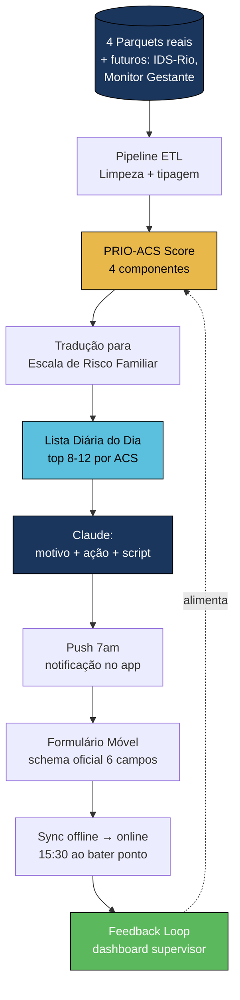

# Rio Impact Lab 2026 — Documento Master de Contexto

> **Hackathon Claude Impact Lab 2026 — Saúde** · Prefeitura do Rio × Anthropic
> **Última atualização:** 2026-05-24
> **Status:** Engenharia de contexto consolidada — pronta para fase de especificação
> **Objetivo deste documento:** servir como fonte única de verdade para todo o time (humanos + IAs) entender o problema, os dados, os frameworks e o desenho proposto antes de começar a construção.

---

## Índice

1. [Resumo Executivo](#1-resumo-executivo)
2. [O Hackathon](#2-o-hackathon)
3. [O Problema — 4 Camadas de Entendimento](#3-o-problema--4-camadas)
4. [Stakeholders & Personas](#4-stakeholders--personas)
5. [Dataset Real — Perfilamento](#5-dataset-real)
6. [Frameworks Aplicáveis](#6-frameworks)
7. [Arquitetura Proposta da Solução](#7-arquitetura-proposta)
8. [Riscos e Failure Modes Documentados](#8-failure-modes)
9. [Métricas de Impacto Para o Pitch](#9-metricas-de-impacto)
10. [Próximos Passos — Especificação](#10-proximos-passos)
11. [Referências](#11-referencias)

---

## 1. Resumo Executivo

O Rio de Janeiro tem **6.200 Agentes Comunitários de Saúde (ACS)** distribuídos em **1.240 equipes** que acompanham **4,5 milhões de residentes** em todas as Áreas Programáticas. Hoje, cada ACS decide quem visitar com **memória, papel e intuição** — não há lista priorizada, não há alerta de cadência vencida, não há notificação quando um paciente vai à urgência. O resultado: pacientes de alto risco esperam semanas, internações preveníveis seguem acontecendo, e o financiamento federal via indicadores Previne Brasil fica abaixo do potencial.

O desafio do hackathon: **construir um sistema que mostra, todo amanhecer, quem cada ACS deve visitar — em qual ordem, por qual motivo, baseado em risco real e lacunas de cuidado** — pronto para a Prefeitura usar amanhã.

### Achados que mudam tudo

| # | Descoberta | Origem |
|---|------------|--------|
| 1 | **49,9% dos pacientes cadastrados NUNCA foram visitados em 2025** | Profilagem dataset |
| 2 | **43% das gestantes tiveram evento de urgência/emergência/internação** vs ~20% das outras coortes | Profilagem dataset |
| 3 | Existe lista oficial brasileira (Portaria SAS/MS 221/2008 — ICSAP) — define legalmente "evento prevenível" | Pesquisa |
| 4 | Existe Escala de Risco Familiar oficial (Ficha A SIAB/SISAB) — 3 categorias × cadência | DOCX SMS-Rio |
| 5 | Existem 8 linhas de cuidado oficiais com cadência mínima — TB diário, gestante alto-risco semanal | DOCX SMS-Rio |
| 6 | Prioridade zero declarada da Prefeitura = mortalidade materno-infantil | Reunião Monitor Gestante |
| 7 | Camila (ACS Rocinha) explicitamente validou: "lembrete + checkbox sim/não é útil" | Entrevista campo |
| 8 | Dor #1 da ACS = registro duplo (papel em campo → digita no Vita ao voltar) — ~1h/dia perdida | Entrevista campo |
| 9 | NHS PRISMATIC trial: score sem bundle de ação **aumentou** internações em 230k pacientes | Pesquisa NHS |
| 10 | Eventos clínicos do dataset = 71% agendamento + 29% urgência/emergência/internação **agregada** (não separa os 3) | Profilagem dataset |
| 11 | **5 fichas oficiais SMS-Rio/SUBPAV 2022** definem cada linha de cuidado — convertidas para JSON dev-ready | Doc oficial SMS |

---

## 2. O Hackathon

| Campo | Valor |
|-------|-------|
| Evento | Claude Impact Lab 2026 — 6º global, 1º no Brasil |
| Organizador | João Lisboa (Anthropic Cloud Community Ambassador) + TAC |
| Parceiros | Prefeitura do Rio (Sec. Saúde + Sec. Desenvolvimento Econômico + CompStat) |
| Local | Maravale |
| Data | 2026-05-24 |
| Deadline | 16:15 (6h30 de build) |
| Inscrições | 600+ recebidas, ~100 selecionados |
| Trilhas | Saúde + Segurança |

### Critérios de avaliação

| Critério | Peso | Foco |
|----------|------|------|
| **Impacto Real** | 40% | "A Prefeitura usaria amanhã?" — viabilidade de deploy |
| Produto (UX/UI) | 20% | Experiência ao abrir o produto |
| Engenharia | 20% | Qualidade técnica, arquitetura, implementável |
| Ideia | 10% | Originalidade |
| Apresentação | 10% | Pitch de 6 minutos (só finalistas) |

**Finalistas:** 3 por trilha = 6 no total.
**Prêmio:** Rio Web Summit + $500 créditos Anthropic + destaque global Anthropic.
**Créditos por participante:** $70 Anthropic. Usar Sonnet (não Opus).

---

## 3. O Problema — 4 Camadas

### 3.1 Camada Oficial (Documento SMS-Rio)

> **"O ACS decide o roteiro do dia com base em memória e intuição, sem acesso a dados consolidados sobre risco, lacunas de visitação ou eventos recentes dos pacientes."**

Os 6 gaps oficiais identificados pela SMS-Rio:

| Gap | Impacto |
|-----|---------|
| Planejamento por memória | ACS visita quem lembra |
| Sem alerta de lacunas | Pacientes ficam sem visita por semanas |
| Rota ineficiente | Reduz visitas/dia |
| Priorização não sistematizada | Gestante alto-risco = família saudável |
| Busca ativa sem dados | ACS não sabe quem faltou à consulta |
| **Comunicação fragmentada** | **Internação/alta/emergência chegam sem registro** |

### 3.2 Camada de Campo (Camila — ACS Rocinha)

#### Rotina real
1. Chega na clínica, bate ponto, reunião breve
2. Verifica pendências e demandas (gerada na reunião de equipe)
3. Se sem demanda específica → vai "aleatório" em pacientes crônicos conhecidos
4. **1-2h em campo** com 5+ visitas (mais quando há cadastro novo)
5. Volta às 15:30, bate ponto
6. **~1h/dia digitando** no VitaCare o que ela já anotou no caderno/WhatsApp

#### Dor #1 — Registro duplo
> _"Se desse para fazer isso na hora que você está visitando e exportar depois, seria muito mais rápido."_

#### Dor #2 — Não sabe quem foi à UPA
> _"Nosso prontuário não se comunica com o prontuário dos hospitais. Muitas vezes a gente não sabe o que aconteceu."_

#### Dor #3 — Pacientes "invisíveis"
- Quem trabalha em horário comercial
- Idosos cuja família trabalha (cuidador ausente)

#### Validações diretas da Camila
| Nossa hipótese | Reação |
|---------------|--------|
| Lista priorizada do dia | ✅ "É bom, é útil. Eu lembro. E tem pacientes que não lembro." |
| Ordem das visitas | ⚠️ "Eu passo na ordem que eu falei. Eu sei onde moram." → não dite ordem |
| Ficha sim/não móvel | ✅✅ "Claro que sim. Você tira a ficha de lá." |
| Lembrete de cadência | ✅ Validado |
| Offline-first | ✅ Mandatório (favela = wifi inconfiável) |

### 3.3 Camada Clínica (Lorena — Médica de Família Rocinha)

#### Demanda gerada para o ACS
> _"A partir do que a gente identifica em consulta — pré-natal, puericultura, atendimento que pegou risco — a gente fala na reunião pra ele ir lá ver."_

#### Como avalia o ACS
> _"Pelo registro, pelos problemas levados pra equipe que foram resolvidos, e pela planilha de vigilância da equipe."_

#### Asfalto vs Favela (estrutural)

| | Asfalto | Favela |
|---|---------|--------|
| Mapeamento | Google Maps + satélite | **Não mapeada** (becos, vielas) |
| SUS geolocation | Funciona | Limitado |
| Vulnerabilidade | Menor | Maior |
| TB concentrada | Distribuída | **Becos sem sol = focos** |

### 3.4 Camada Sistêmica (Reunião Monitor da Gestante)

#### Prioridade zero declarada
> _"Uma mulher grávida morrer é a pior catástrofe que a gente pode ter pensando em população. Prioridade zero do município: reduzir mortalidade materna e infantil."_

#### Combo crítico identificado pelo próprio SMS
> _"Mulher grávida + sem benefício social + diabética = vai subindo o score, prioridade alta."_

#### Monitor da Gestante
- Painel novo em rollout — específico para gestantes
- Solução do hackathon deve **complementar**, não substituir

---

## 4. Stakeholders & Personas

### Personas operacionais (usuários do sistema)

| Persona | Quem | Característica | Implicação UX |
|---------|------|----------------|---------------|
| **Camila** | ACS Rocinha (validada) | Tech-savvy, usa WhatsApp+Notes | Persona principal |
| **Odete** | ACS idosa (mencionada por Camila e Lorena) | Esquece campos, deixa cadastro pra depois | **Persona limite** — UX baixíssimo atrito |
| **Lorena** | Médica de família | Supervisora, gera demandas em reunião | Dashboard supervisor |
| **Gestor AP** | Coordenador Área Programática | Quer indicadores Previne | Dashboard gestão |

### Stakeholders institucionais

| Quem | Papel |
|------|-------|
| Carol Canedo | Gerente de Dados SMS — problem owner |
| Pedro | Data engineer SMS — disponível para dúvidas |
| João Lisboa | Organizador, Anthropic Ambassador |
| Osmar | Sec. Desenvolvimento Econômico Rio |

---

## 5. Dataset Real — Perfilamento

**Fonte:** 4 arquivos Parquet baixados de Google Drive (oficial GitHub repo `prefeitura-rio/claude-impact-lab-saude`).
**Janela temporal:** 2025-01-01 → 2025-12-31 (sequência preservada após date shifting; ano calendário pode não ser real).

### 5.1 Visão geral

| Dataset | Linhas | Campos | Memória |
|---------|--------|--------|---------|
| `pacientes` | 97.938 | 12 | ~16 MB |
| `eventos_clinicos` | 100.503 | 3 | ~4.5 MB |
| `visitas` | 159.599 | 4 | ~5.4 MB |
| `equipes` | 49 | 3 | ~6 KB |

### 5.2 `pacientes` — Esquema e distribuições

```
paciente_id (str, hash)
equipe_id (str, hash)
unidade_id (str, hash)
faixa_etaria (str)         # ex: "0-6"
sexo (str)                  # Feminino / Masculino
raca_cor (str)              # Branca / Parda / Preta / Outros
situacao_vulnerabilidade (bool)
endereco_longitude (float)
endereco_latitude (float)
hipertenso (bool)
diabetico (bool)
gestacao (bool)
```

**Distribuição:**

- **Equipes:** 49 (sample = ~4% das 1.240 do município — provavelmente região Maracanã)
- **Pacientes por equipe (médio):** ~2.000
- **Raça/Cor:** Branca 47,6% · Parda 36,0% · Preta 14,7% · Outros 1,7%

**Flags clínicos/sociais:**

| Flag | % |
|------|---|
| Hipertenso | 21,5% (21.017 pacientes) |
| Diabético | 8,3% (8.172 pacientes) |
| Gestação | 0,7% (661 pacientes) |
| Vulnerabilidade social | 9,4% (9.191 pacientes) |

**Multimorbidade (hiperten. + diabet. + gestação):**

| # flags | Pacientes | % |
|---------|-----------|---|
| 0 | 74.520 | 76,1% |
| 1 | 16.986 | 17,3% |
| 2 | 6.432 | 6,6% |
| 3 | 0 | 0% |

**Gestantes em combo de risco:**

| Filtro | Gestantes |
|--------|-----------|
| Total | 661 |
| Gestante + diabetes | 6 |
| Gestante + hipertensa | 41 |
| Gestante + vulnerabilidade | 107 |
| Gestante + DM + vulnerabilidade | 0 (amostra não captou) |


### 5.3 `eventos_clinicos` — Esquema e perfil

```
paciente_id (str, hash)
tipo (str)                  # 2 valores apenas:
                            #   "agendamento" (71,3%)
                            #   "urgencia-emergencia-ou-internacao" (28,7%)
data_referencia (date)
```

**⚠️ Limitação confirmada:** o tipo `urgencia-emergencia-ou-internacao` agrega 3 situações distintas. Não é possível separar PA / UPA / Internação só com esse dataset. Para o pitch, tratar como **"evento não-eletivo"**.

| Estatística | Valor |
|-------------|-------|
| Total eventos | 100.503 |
| Pacientes com pelo menos 1 evento | 32.992 (33,7% dos cadastrados) |
| Pacientes com urgência/emergência/internação | 14.437 (14,7%) |
| Mediana de eventos por paciente com evento | 2 |
| P95 de eventos por paciente | 9 |
| Máximo | 73 eventos em 1 paciente |

**Urgência por grupo (achado clínico relevante):**

| Grupo | % com urgência/emergência/internação |
|-------|--------------------------------------|
| **Gestantes** | **43,1%** (285 / 661) ⚠️ |
| Vulnerabilidade social | 20,8% (1.915 / 9.191) |
| Hipertensos | 19,1% (4.012 / 21.017) |
| Diabéticos | 18,6% (1.517 / 8.172) |

**Leitura:** gestantes têm **2× a taxa de evento não-eletivo** comparado às outras coortes. Confirma empiricamente a prioridade zero declarada do município (mortalidade materno-infantil).


### 5.4 `visitas` — Esquema e perfil

```
profissional_id (str, hash)   # ACS ou outro profissional
registrados_em (date)
ordem_visita_dia (int)
paciente_id (str, hash)
```

| Estatística | Valor |
|-------------|-------|
| Total de visitas | 159.599 |
| Profissionais únicos | 3.531 |
| Pacientes visitados | 49.100 |
| **Pacientes NUNCA visitados em 2025** | **48.838 (49,9%)** ⚠️⚠️ |
| Média de visitas por paciente visitado | 3,3 |
| Média de visitas por profissional/dia | 2,0 |
| Média de visitas totais por dia | 437 |

**Gap de visita (entre última visita registrada e fim do período):**

| Percentil | Dias |
|-----------|------|
| Média | 119,8 |
| Mediana (P50) | 90 |
| P75 | 185 |
| P95 | 320 |

**Leitura crítica:**
- **Metade dos pacientes cadastrados nunca foi visitada no ano.** Provavelmente reflete: pacientes "inativos" + pacientes que entraram tarde no cadastro + viés de subregistro.
- Mediana de 90 dias = paciente típico não é visitado há 3 meses.
- Mesmo entre os que foram visitados, P75 ≈ 6 meses sem visita.
- A "cadência mensal mínima por lei" não está sendo cumprida na amostra.


### 5.5 `equipes` — Esquema

```
equipe_id (str)
endereco_latitude (float)
endereco_longitude (float)
```

49 equipes. Apenas a localização da unidade — `ACS sempre começam aqui` (confirmação README).


### 5.6 O que NÃO está no dataset (gaps conhecidos)

| Faltante | Citado em | Plano |
|----------|-----------|-------|
| CID-10 detalhado | Transcripts + DOCX | v2 via integração VitaCare |
| Flag de tuberculose | Lorena/SMS | v2 |
| Acamado / restrição mobilidade | DOCX | v2 |
| Saúde mental | DOCX | v2 |
| Adesão a medicamento | Transcripts | v2 |
| Comparecimento S/N em agendamentos | DOCX descreve, README não confirma | **Inferir do dataset:** agendamento sem urgência seguinte ≈ compareceu (heurística) |
| Histórico de internação detalhado | Lorena | v2 (DataSUS/SIH) |
| Resultados de exames | Camila | v2 (VitaCare) |
| Conteúdo da visita | Schema | v2 (formulário móvel preenche isso) |

---

## 6. Frameworks Aplicáveis

### 6.1 Frameworks Oficiais Brasileiros

| Framework | Origem | Como usar no MVP |
|-----------|--------|------------------|
| **Escala de Risco Familiar** | Ficha A SIAB/SISAB (MS) | Output do score → Alto/Médio/Habitual + cadência |
| **8 Linhas de Cuidado oficiais** | DOCX SMS-Rio | Bundle de ação por paciente |
| **ICSAP — Portaria SAS/MS 221/2008** | MS, 19 grupos diagnósticos | Métrica de impacto |
| **Previne Brasil — 15 indicadores 2026** | Portaria 3.493/2024 | Mapeamento dashboard gestão |
| **Carteira de Serviços APS** | MS | Catálogo de prioridade |
| **Manual e Guia Prático do ACS** | MS | Vocabulário oficial |

### 6.2 Fichas Operacionais Oficiais SMS-Rio (versão 1.0 — 2022)

A SMS-Rio entregou **5 fichas oficiais** que são os formulários de campo usados pelo ACS. Foram convertidas em JSON dev-ready em `docs/FICHAS/`. Cada ficha é a fonte canônica para uma linha de cuidado.

| Ficha | Código SMS | Linha de cuidado | Cadência mínima | JSON |
|-------|-----------|------------------|------------------|------|
| **FICHA A** | SMSDC008_SIAB | Base — Cadastramento | Pontual + atualização anual | `ficha_a_cadastro_familia.json` |
| **FICHA B CRÔNICO** | SMSRIO019_FICHA_B | HAS / DM / Asma / DPOC / Idoso vulnerável | Mensal (descompensado: quinzenal) | `ficha_b_cronico.json` |
| **FICHA B GESTANTE** | SMSRIO013_FICHA_B | Pré-natal / Puerpério | Mensal (alto risco: semanal) | `ficha_b_gestante.json` |
| **FICHA C** | SMSRIO001_FICHA_C | Primeira infância (0-6 anos) | Mensal | `ficha_c_primeira_infancia.json` |
| **FICHA B TB** | SMSRIO015_FICHA_B | Tuberculose / TDO | **Diário (TDO)** | `ficha_b_tuberculose.json` |

#### Estrutura comum
Todas têm cabeçalho idêntico (Unidade, Equipe, Microárea, ACS, Data) + identificação do paciente + seção de perguntas indexadas por visita + legendas/enums. Ver `_shared.json` para enums reusáveis (sexo, raça/cor, religião, deficiência, grupos de saúde, etc.).

#### Triggers críticos identificados em cada ficha

| Ficha | Sinal que dispara escalonamento |
|-------|--------------------------------|
| Crônico | P6 == 'S' (UPA/Emergência) · P7 == 'S' (machucado pé em DM) |
| Gestante | P5 == 'S' (sangramento < 12 sem) · P9 == 'N' (não sentiu bebê > 25 sem) · PA ≥ 140/90 |
| Primeira Infância | P1 == 'N' (sem primeira consulta em 7d) · P6 inclui gemido/cansaço respirar · P9 == 'S' (insegurança alimentar) |
| TB | 2+ doses TDO faltando · P2 inclui urina escura/pele amarelada (hepatotoxicidade) |
| FICHA A | Melhor horário de visita captado → resolve gap de pacientes invisíveis |

#### Como o app usa
1. Carrega o JSON conforme perfil do paciente
2. Renderiza dinamicamente — `tipo` controla o widget, `obrigatorio` ativa validação, `visivel_se` aplica visibilidade condicional
3. Salva offline (IndexedDB) com `ficha_id` + `versao_oficial`
4. Sincroniza no retorno à clínica (15:30, padrão Camila)
5. Dispara `regras_negocio` no backend para alimentar o score PRIO-ACS

#### Mapeamento Ficha → Trigger no score PRIO-ACS

```
FICHA A → cadastra base (4 flags + situacao_vulnerabilidade)
FICHA B Gestante → boost +25 life-stage + 35 ICSAP grupo 19
FICHA B Crônico → boost +15 ICSAP grupo 9 (HAS) ou 13 (DM)
FICHA C → boost +20 life-stage (criança 0-6) + indicadores Previne crianças
FICHA B TB → linha de cuidado diária (TDO) — fora da escala normal
```

---

### 6.3 Frameworks Internacionais (Benchmark)

#### NHS / Reino Unido

| Modelo | O que aprender |
|--------|----------------|
| **Bridges to Health (B2H)** | Segmenta TODA população em 8 grupos por estágio de vida |
| **Electronic Frailty Index (eFI/eFI2)** | Math transparente: conta deficits de lista fixa |
| **Virtual Wards** | Padrão de dashboard diário multidisciplinar |
| **Community Matron** | Caseload cap (Sargent 2008: passar do limite vira reativo e aumenta internação) |
| **PRISMATIC trial** | ⛔ **CONTRA-EXEMPLO** — score sem bundle aumentou internações |
| **NHS Proactive Care Framework** | Bundle > score: medicação + queda + cognitivo + plano cuidado |
| **SPARRA v4 (Escócia)** | ML em escala nacional — modelo aspiracional, não MVP |

#### CHW Internacional

| Programa | O que aprender |
|----------|----------------|
| **Índia ASHA (~1M)** | NÃO criar app paralelo (multi-app é dor confirmada) |
| **Rwanda RapidSMS-MCH** | Push event-triggered: 7am SMS com lista do dia |
| **Etiópia Family Folder** | Mental model: ACS pega 8-12 famílias pela manhã |
| **Paquistão LHW Khaandan** | Cadência floor (1×/mês obrigatório) — AI ordena, não decide |
| **EUA PRAPARE** | Captura SDOH em 15+5 perguntas estruturadas |
| **Penn IMPaCT** | ROI documentado para CHW |

#### Frameworks Clínicos de Estratificação

| Framework | Aplicabilidade no dataset |
|-----------|---------------------------|
| **Charlson Comorbidity Index** | ⚠️ Requer CIDs — adaptar para flags disponíveis |
| **HCC (CMS) v28** | ⚠️ Requer CIDs — usar lógica de hierarquia |
| **LACE-lite** | ✅ Parcial: "E" via eventos_clinicos.urgência |
| **High-Risk Pregnancy** | ✅ Combinação de gestação + idade + flags |
| **CDC SVI / ADI** | ✅ Substituir por IDS-Rio (índice desenvolvimento social) |
| **ACSC (Portaria 221)** | ✅ Mapear flags para os 19 grupos |

### 6.4 Síntese: Score PRIO-ACS — Adaptado ao Framework Oficial

**Score 0-100, 4 componentes aditivos:**

```
ICSAP proxy (35 pts):
  +15 hipertenso     [ICSAP grupo 9]
  +15 diabético      [ICSAP grupo 13]
  +15 gestação       [ICSAP grupo 19]
  cap em 35

Vulnerable life-stage (25 pts):
  +25 gestação
  +20 faixa_etaria "0-6"
  +15 idoso (65+) + crônico
  (pega o maior, não soma)

Care gap / urgency (25 pts):
  +15 evento não-eletivo nos últimos 60d
  +10 gap visita > limite_por_grupo
     (gestante: 30d / criança<5: 45d / crônico: 90d / geral: 180d)

Social vulnerability (15 pts):
  +15 situacao_vulnerabilidade

TRADUÇÃO para Escala de Risco Familiar (oficial):
  0-30   → Risco habitual    → Mensal
  31-60  → Risco médio       → Quinzenal a mensal
  61-100 → Risco alto        → Semanal a quinzenal
```

---

## 7. Arquitetura Proposta

### 7.1 Diagrama de fluxo



### 7.2 Camadas

| Camada | O que faz | Tecnologia sugerida |
|--------|-----------|---------------------|
| **Data** | Lê 4 Parquets + futuras integrações | DuckDB / pandas |
| **Score** | Computa PRIO-ACS por paciente | Python puro (regras explícitas) |
| **API** | Expõe lista do dia, registra visita | FastAPI |
| **Frontend ACS** | PWA mobile-first, offline-first | React/Vue + IndexedDB |
| **Frontend Supervisor** | Dashboard cobertura por linha de cuidado | React + Recharts |
| **Claude integration** | Motivo + ação + script de abordagem | Anthropic API (Sonnet) |
| **Push** | Notificação 7am | Service Worker / OneSignal |
| **Sync** | Offline-first, sync no final do dia | Background sync API |

### 7.3 Os 3 ecrãs essenciais

#### Ecrã 1 — ACS Manhã (mobile)
```
┌───────────────────────────────┐
│  Bom dia, Camila              │
│  Equipe Cachopinha            │
├───────────────────────────────┤
│  📋 Sua lista de hoje (8)     │
│                               │
│  ⚠️ Maria S. — gestante       │
│  Há 35 dias sem visita        │
│  Motivo: cadência vencida     │
│  Bundle: peso, PA, sinais     │
│         alerta                │
│  ▸ Iniciar visita             │
│                               │
│  🩺 João P. — HAS + DM        │
│  Foi à UPA há 5 dias          │
│  Motivo: egresso de emergência│
│  Bundle: aferir PA, glicemia, │
│         medicação              │
│  ▸ Iniciar visita             │
│                               │
│  [...mais 6...]               │
└───────────────────────────────┘
```

#### Ecrã 2 — Formulário em Campo (6 campos oficiais)
```
┌───────────────────────────────┐
│  Visita: Maria S.             │
├───────────────────────────────┤
│  Realizada?                   │
│  ☑ Sim  ☐ Ausente  ☐ Recusada │
│                               │
│  Motivo                       │
│  ▼ Acompanhamento             │
│                               │
│  Busca ativa                  │
│  ☑ Gestante    ☐ Vacina       │
│  ☐ Consulta    ☐ Exame        │
│                               │
│  Condição acompanhada         │
│  ▼ Pré-natal habitual         │
│                               │
│  Observações (opcional)       │
│  [áudio → transcrição]        │
│                               │
│  [SALVAR — fica no celular,   │
│   sincroniza ao chegar]       │
└───────────────────────────────┘
```

#### Ecrã 3 — Dashboard Supervisor
```
┌───────────────────────────────────────────────────┐
│  Equipe Cachopinha — Cobertura por linha de cuid. │
├───────────────────────────────────────────────────┤
│  Gestantes        12/12  ✅ 100% (cadência ok)    │
│  Crianças 0-2     38/42  ⚠️  90%                  │
│  HAS              178/210 ⚠️  85% (32 atrasados)   │
│  DM               45/52  ✅  87%                   │
│                                                   │
│  📈 15 indicadores Previne — equipe ranqueada 3/49│
│  💰 R$ Y mil/mês de financiamento federal         │
│                                                   │
│  Internações ICSAP (12m): 3 ↓ 30% vs ano anterior│
└───────────────────────────────────────────────────┘
```

---

## 8. Failure Modes Documentados

| Erro | Origem | Como evitamos |
|------|--------|---------------|
| Score sem bundle de ação → aumenta internações | PRISMATIC Wales 230k | Cada paciente vem com motivo + ação esperada |
| Fragmentação de apps | Índia ASHA | Integrar com VitaCare (futuro), não criar paralelo |
| Admin burden > visitas | Etiópia | UI ≤3 toques por interação |
| Workload sobe sem pagamento subir | ASHA | Demonstrar economia (1h/dia) |
| CHW não vê impacto do dado | Ruanda + Índia | Feedback loop semanal com indicadores Previne |
| Caseload acima do limite | Sargent 2008 | Cap 8-12 famílias/dia, nunca 50 |
| Black-box ML sem explicabilidade | Literatura 2024-26 | Score aditivo transparente, motivo legível |
| Dite a rota e ACS ignora | Camila explicitamente | Mostrar lista, ela define rota |
| Não funciona offline | Camila | Offline-first via Service Worker |
| Não funciona para Odete (low-tech) | Lorena confirma | Validação em tempo real + zero re-trabalho |

---

## 9. Métricas de Impacto Para o Pitch

> **Análise completa em `docs/ROI.md`** — números, premissas e fontes detalhadas. Esta seção resume os 4 números-chave + atualiza o que ficou defasado em outras seções deste doc.

### 9.0 Os 4 números-chave do pitch (cenário base Rio)

| # | Métrica | Valor | O que significa |
|---|---------|-------|-----------------|
| 1 | **ROI 47×** em regime | R$ 1 → R$ 47 retorno | Mais lucrativo que qualquer ativo financeiro |
| 2 | **R$ 40 milhões/ano** | Benefício direto Rio | R$ 10M ICSAP evitadas + R$ 30M Previne capturado |
| 3 | **1,1 milhão horas-ACS/ano** | Capacidade liberada | = 907 ACS extras sem concurso |
| 4 | **6.000 internações/ano evitadas** | ICSAP em Rio | ~10% das internações sensíveis à APS |

**Payback < 30 dias · NPV 5 anos = R$ 135M · Custo: R$ 0,31 por ACS por dia**

### 9.0-bis Framing alternativo (B) — produtividade como contratação evitada

Para audiência de Fazenda / Casa Civil / RH:

| Métrica | Valor | Cálculo |
|---------|-------|---------|
| Ganho bruto de produtividade por ACS | **20%** | 1h/dia em 5h efetivas (Camila) |
| Adesão realista | 60% | Mesma do cenário base |
| Ganho efetivo | 12% | 60% × 20% |
| **Contratações de ACS evitadas (Rio)** | **907** | 12% × 7.555 |
| Custo-empresa/ACS/ano | R$ 60.000 | Piso 2025 + encargos |
| **Folha de pagamento evitada (Rio)** | **R$ 54M/ano** | 907 × R$ 60k |
| **ROI framing B** | **64×** | R$ 54M / R$ 0,85M custo |
| **Escala nacional (281k ACS, 12%)** | **R$ 2 bilhões/ano** | 33.727 ACS-equivalente × R$ 60k |

> ⚠️ **NÃO somar com 9.0** — as horas-ACS liberadas são as mesmas. A Prefeitura escolhe entre "usar para qualidade" (A) ou "usar para crescer sem contratar" (B). Detalhes em `docs/ROI.md` §5.

### 9.1 Métrica primária — Mortalidade materno-infantil
- Prioridade zero declarada da Prefeitura
- 43% das gestantes da amostra tiveram urgência/emergência/internação
- Combo crítico: gestante + DM + vulnerabilidade
- **Marginal da solução: 15–30 mortes infantis evitadas/ano em Rio** (Aquino 2009 + Rasella BMJ 2014 aplicados sobre baseline ESF atual)
- **Escala nacional: 1.750–3.500 mortes infantis evitadas/ano**

### 9.2 Métrica secundária — ICSAP (Portaria 221/2008)
- **~2 milhões de internações ICSAP/ano no Brasil** (Bordin et al. C&SC 2024 — atualiza o 836k antigo)
- 15-20% das internações SUS são ICSAP (27% pela classificação DRG)
- Custo médio ICSAP: **R$ 1.500-2.000/internação**
- Estimativa Rio: ~60.000 ICSAP/ano; solução evita **6.000 (10% redução)** = **R$ 10,2M/ano**
- **Escala nacional: 200k internações evitadas × R$ 1.700 = R$ 340M/ano**

### 9.3 Métrica de produtividade — Tempo economizado
- Camila: ~1h/dia em registro duplo (validado em entrevista)
- **7.555 ACS** (atualizado Fiocruz dez/2024, era 6.200 antigo) × 1h × 242 dias × 60% adesão = **1.097.000 horas/ano**
- Em valor de mão-de-obra: × R$ 31/h = **R$ 34M/ano em capacidade reaproveitada**
- Equivale a **~565 ACS extras de capacidade** sem contratar ninguém
- ⚠️ **Tratar como capacidade, não caixa** — alimenta os ganhos ICSAP+Previne, não somar separadamente

### 9.4 Métrica financeira — Previne Brasil 2026
- Novo modelo (Portaria 6.907/2025): pagamento por classificação composta (Ótimo/Bom/Suficiente/Regular)
- **Diferença "Bom → Excelente" = R$ 8.000/mês = R$ 96.000/ano por equipe**
- Rio: 1.240 equipes ESF · cenário base: 25% sobem para Excelente = 310 equipes
- **Receita federal extra: R$ 29,8M/ano em regime** (R$ 11,9M no ano 1 com 10% adesão)
- 4 dos 7 indicadores mapeiam direto com os flags do dataset (HAS, DM, gestação, vulnerabilidade)

### 9.5 Métricas operacionais (metas internas)
- 49,9% pacientes nunca visitados em 2025 → meta: reduzir a <20%
- P50 de gap = 90 dias → meta: <30 dias
- Cobertura por linha de cuidado: >90% para gestantes (alto-risco semanal)

### 9.6 Custos da solução (consolidado)

| | Ano 1 | Anos 2-5 (cada) |
|--|-------|-----------------|
| CAPEX dev (6 meses) | R$ 347k | — |
| Claude API + Infra | R$ 567k | R$ 567k |
| OPEX humano | R$ 283k | R$ 283k |
| **TOTAL** | **R$ 1,2M** | **R$ 0,85M** |
| **R$/ACS/ano** | R$ 158 | **R$ 113** |

### 9.7 Sensibilidade (stress test)

| Cenário | Benefício/ano | ROI |
|---------|--------------|-----|
| Pessimista (40% adesão, 5% redução, 10% Previne) | R$ 15M | 17× |
| **Base (60/10/25%)** | **R$ 40M** | **47×** |
| Otimista (80/15/50%) | R$ 83,5M | 98× |
| **Stress test "tudo dá errado"** (30/2/0%) | R$ 0,9M | **>1×** (ainda paga) |

### 9.8 Benchmark internacional
- **Penn IMPaCT** (RCT, EUA, Kangovi et al. Health Affairs 2020): ROI 2,5× ($2,47/$1), -30% admissões, -38% custo
- Nossa solução é **extensiva** (amplifica ACS existentes) em vez de intensiva (1 novo CHW por 100 pacientes) → ROI maior é defensável

---

## 10. Próximos Passos — Especificação

> **Fase atual:** engenharia de contexto concluída. **Próxima fase:** especificação técnica detalhada antes de codificar.

### 10.1 Pendências técnicas para investigar

| # | Pergunta | Status | Onde buscar |
|---|----------|--------|-------------|
| 1 | **VitaCare API** — auth, endpoints, schema, rate limits | Não publicado ainda. TI da Prefeitura promete | Aguardar publicação no repo |
| 2 | **Comparecimento S/N em agendamentos** | DOCX descreve, Parquet não tem campo | Inferir por heurística: agendamento + urgência seguinte ≈ não-comparecimento? Cruzar com Pedro |
| 3 | **e-SUS-AP / PEC** compatibilidade nacional | Não investigado | docs.aps.saude.gov.br |
| 4 | **Monitor da Gestante** — API ou tabela | Sistema novo em rollout | Perguntar à equipe SMS-Rio |
| 5 | **LGPD** para dados de saúde | Não investigado | Pesquisar + caso de uso anonimizado |
| 6 | **Infra de deploy** Prefeitura | Não investigado | Perguntar Pedro/Carol |
| 7 | **IDS-Rio por setor censitário** | Mencionado em pesquisa, não confirmado | data.rio + IBGE |
| 8 | **Que equipe é o sample dos Parquets?** | Pedro disse "Maracanã" — confirmar | Pedro / metadados Parquet |
| 9 | **Distribuição lat/lon faz sentido geograficamente?** | Plot gerado, mas sem georeferência | Sobrepor com mapa Rio (Folium) |
| 10 | **Há campo `tipo` no `visitas`?** (motivo/desfecho) | Esquema atual só tem profissional/data/ordem/paciente | Perguntar — DOCX sugere que sim |

### 10.2 Decisões de produto pendentes

| Decisão | Opções | Recomendação |
|---------|--------|--------------|
| Surface principal | Web PWA / Mobile app nativo / Tablet | **Web PWA** — funciona em celular + tablet, install opcional |
| Persistência cliente | LocalStorage / IndexedDB / SQLite WASM | **IndexedDB** — pattern padrão PWA offline |
| Backend | FastAPI / Flask / Node | **FastAPI** — tipagem + docs auto + async |
| DB server | SQLite / PostgreSQL / DuckDB | **DuckDB** — leitura nativa Parquet + zero infra |
| Auth | OIDC Prefeitura / token simples / nenhum (demo) | **Demo: token simples**. v2: OIDC |
| Mapas | Leaflet + OSM / Mapbox / Google | **Leaflet + OSM** — open + funciona em Rio |
| Push | Web Push / SMS / e-mail | **Web Push** (demo) — SMS pra v2 |

### 10.3 Especificação técnica — work breakdown

| # | Entregável | Owner sugerido | Tempo | Dependência |
|---|-----------|----------------|-------|-------------|
| 1 | Schema final do dataset + validação | Engenharia | 30 min | Parquets baixados ✅ |
| 2 | Função `compute_prio_acs(paciente_id) → dict` | Engenharia | 1h | Schema |
| 3 | Função `gerar_lista_do_dia(profissional_id, data) → [paciente]` | Engenharia | 30 min | Score |
| 4 | API FastAPI: 4 endpoints (lista, visita, score, dashboard) | Engenharia | 1h | Funções |
| 5 | Frontend ACS: 2 ecrãs (lista + formulário) | Produto | 1h30 | API |
| 6 | Frontend Supervisor: 1 dashboard | Produto | 1h | API |
| 7 | Integração Claude (motivo + bundle) | Engenharia | 30 min | Score |
| 8 | PWA offline (service worker + IndexedDB) | Engenharia | 1h | Frontend |
| 9 | Deploy demo (Vercel/Railway/Cloudflare) | Engenharia | 20 min | Tudo |
| 10 | Screen recording 60s | Produto | 20 min | Deploy |
| 11 | Pitch deck 6 min | Negócio | 1h | Demo |
| 12 | README do repo + estrutura limpa | Engenharia | 30 min | Tudo |

**Buffer:** ~1h para imprevistos + integração.

### 10.4 Cronograma agressivo (ainda hoje, deadline 16:15)

| Hora | Atividade |
|------|-----------|
| Agora → +1h | Espec finalizada + setup repo + schema validado |
| +1h → +3h | Score + API + Claude integration |
| +3h → +5h | Frontends ACS + Supervisor |
| +5h → +6h | PWA offline + deploy + recording |
| +6h → +6h30 | Pitch deck + ensaio + entrega |

### 10.5 Antes de codificar — perguntas para o grupo decidir

1. **Quem é dev, quem é produto, quem é negócio/pitch?**
2. **Aceitamos o PRIO-ACS proposto ou ajustamos pesos?**
3. **Quais 3 dos 6 endpoints são MUST-HAVE para a demo?**
4. **A demo vai mostrar a Camila falando (gravado) ou só o produto?**
5. **Vamos cravar Web PWA ou tem alguém forte em Flutter/RN que muda jogo?**
6. **Quem grava a screen recording final?**

---

## 11. Referências

### Documentos do hackathon
- [GitHub: prefeitura-rio/claude-impact-lab-saude](https://github.com/prefeitura-rio/claude-impact-lab-saude)
- [Apresentação oficial](https://docs.google.com/presentation/d/1hf5jq8iFGiDaf3u5UA4Jtd7wQ7eWWchfEn6Fvm0ArOM/edit)
- [Briefing](https://docs.google.com/document/d/1hwk6J7hjSNvCJL2QLxpYUdCjB7u1ec3A/edit)
- DOCX: `Hackaton SMS RIO_ACS.docx` (em `temp/tmp/`)

### Frameworks oficiais brasileiros
- [Portaria SAS/MS 221/2008 — Lista ICSAP](https://www.cosemssc.org.br/wp-content/uploads/2022/02/5.pdf)
- [Portaria 3.493/2024 — 15 indicadores Previne 2026](https://www.cosemssp.org.br/wp-content/uploads/2024/07/PT-3493-MARINA-MELO.pdf)
- [Previne Brasil — Ministério da Saúde](https://www.gov.br/saude/pt-br/composicao/saps/previne-brasil/)
- [Manual do ACS — MS](http://189.28.128.100/dab/docs/publicacoes/geral/manual_acs.pdf)
- [Guia Prático do ACS — MS](http://189.28.128.100/dab/docs/publicacoes/geral/guia_acs.pdf)
- [Biblioteca SUS do Rio](https://bibliotecasus.subpav.org/)

### Pesquisa NHS
- [NHS Proactive Care Framework](https://www.england.nhs.uk/long-read/proactive-care-providing-care-and-support-for-people-living-at-home-with-moderate-or-severe-frailty/)
- [Virtual Wards Operational Framework](https://www.england.nhs.uk/long-read/virtual-wards-operational-framework/)
- [eFI2 BJGP 2025](https://bjgp.org/content/75/755/249)
- [PRISMATIC trial (NIHR)](https://www.journalslibrary.nihr.ac.uk/hsdr/HSDR06010)
- [Bridges to Health Segmentation](https://outcomesbasedhealthcare.com/bridges-to-health-segmentation-model/)

### Pesquisa CHW Internacional
- [Rwanda RapidSMS-MCH](https://www.ncbi.nlm.nih.gov/pmc/articles/PMC3542808/)
- [PRAPARE SDOH Tool](https://prapare.org/)
- [Penn IMPaCT CHW ROI](https://pmc.ncbi.nlm.nih.gov/articles/PMC8564553/)
- [Ethiopia Family Folder](https://www.jhidc.org/index.php/jhidc/article/view/102/142)
- [Pakistan LHW Khaandan](https://chwcentral.org/pakistans-lady-health-worker-program/)
- [Human-in-the-loop CHW AI](https://pmc.ncbi.nlm.nih.gov/articles/PMC9021941/)

### Frameworks clínicos
- [Charlson ICD-10 Validation](https://pmc.ncbi.nlm.nih.gov/articles/PMC8252530/)
- [LACE Index Predictive Strength](https://www.ncbi.nlm.nih.gov/pmc/articles/PMC5726103/)
- [High-Risk Pregnancy (NICHD)](https://www.nichd.nih.gov/health/topics/high-risk/conditioninfo/factors)
- [CDC SVI](https://www.atsdr.cdc.gov/place-health/php/svi/index.html)

### Artefatos locais deste projeto
- `docs/ROI.md` ← **análise financeira + saúde pública + sensibilidade + extrato pitch**
- `docs/2026-05-24-problem-deep-dive/INDEX.md`
- `docs/2026-05-24-problem-deep-dive/PROBLEM_ANALYSIS.md`
- `docs/2026-05-24-problem-deep-dive/FIELD_NOTES_CAMILA_ACS.md`
- `docs/2026-05-24-problem-deep-dive/OFFICIAL_SMS_RIO_FRAMEWORK.md`
- `docs/2026-05-24-problem-deep-dive/MASTER_CONTEXT.md` ← este documento
- `docs/2026-05-24-problem-deep-dive/data_profile.json`
- `docs/2026-05-24-problem-deep-dive/plots/*.png`
- `docs/FICHAS/README.md` ← guia para back/frontend
- `docs/FICHAS/_shared.json` ← enumerações reusáveis
- `docs/FICHAS/ficha_a_cadastro_familia.json` ← spec dev-ready
- `docs/FICHAS/ficha_b_cronico.json` ← spec dev-ready
- `docs/FICHAS/ficha_b_gestante.json` ← spec dev-ready
- `docs/FICHAS/ficha_c_primeira_infancia.json` ← spec dev-ready
- `docs/FICHAS/ficha_b_tuberculose.json` ← spec dev-ready
- `docs/FICHAS/*.pdf` ← PDFs originais SMS-Rio/SUBPAV 2022
- `docs/Livro_GuiaRapido-PreNatal2025_PDFDigital_20250318.pdf` ← Guia clínico pré-natal 2025
- `temp/transcricoes/*.txt` (5 transcrições originais)
- `temp/tmp/Hackaton SMS RIO_ACS.docx`
- `data/*.parquet` (4 datasets, 20MB)

---

*Documento gerado em 2026-05-24 como entregável de consolidação da fase de engenharia de contexto. Fonte única de verdade para o time antes da fase de especificação.*
