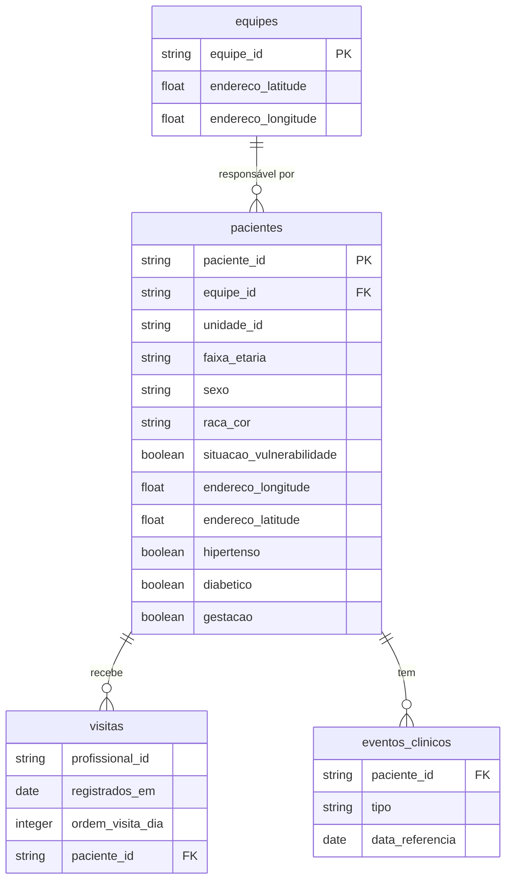

# 🏥 Claude Impact Lab 2026 | Dataset Saúde do Rio

---

> ### ⚠️ **Aviso Importante**
> 
> Todos os dados do desafio passaram por rigoroso **processo de anonimização**, utilizando técnicas de aleatorização, generalização e supressão. 
> 
> **Indicadores gerados a partir dos dados NÃO representam a realidade**. Os dados apenas ilustram as dinâmicas do sistema de saúde. 
> 
> 📖 Para conhecer mais sobre o processo de anonimização, veja a [seção específica](#processo-de-anonimização) ao final deste documento.

---

## 📊 Acesso Rápido aos Dados

| 🗂️ **Tabela** | 📝 **Descrição** | 🔗 **Download (PARQUET)** |
|:--------------|:-----------------|:--------------------------|
| **Cadastros de Pacientes** | Os cadastros de milhares de pacientes | [📥 Download](https://drive.google.com/file/d/1cRvsx5poNTi4EOfWHYvilSDF4_i6hcZy/view?usp=drive_link) |
| **Eventos Clínicos** | As consultas agendadas (via regulação, que devem ser informadas aos pacientes) e as idas em unidades de urgência, emergência e hospitais (que indicam uma necessidade de contato mais próximo) | [📥 Download](https://drive.google.com/file/d/1rcWQbi_vA_RAnXLQV79oe4Z2mql8cn3_/view?usp=drive_link) |
| **Visitas dos ACS** | O histórico de visitas dos Agentes Comunitários de Saúde | [📥 Download](https://drive.google.com/file/d/1dKJ8BpqrmsFNQoVcs9tjJ-Gaag1WzCML/view?usp=drive_link) |
| **Equipes de Saúde** | A relação das equipes e unidades, além de ter a localização da sede. | [📥 Download](https://drive.google.com/file/d/1h8DijXrZM_hnhYMAdkggp5mnb2zckFOW/view?usp=drive_link) |

---

## 📚 Materiais de Apoio

### 📖 Manuais do ACS (Ministério da Saúde)

- 📘 [Manual do Agente Comunitário de Saúde](http://189.28.128.100/dab/docs/publicacoes/geral/manual_acs.pdf)
- 📗 [Guia Prático do ACS](http://189.28.128.100/dab/docs/publicacoes/geral/guia_acs.pdf)
- 🏛️ **[Repositório Principal do Município](https://bibliotecasus.subpav.org/)**

### 📑 Exemplos de Publicações

- 🚨 [Violências e Papel dos ACS](https://subpav.org/aps/uploads/publico/repositorio/SMS_ViolenciasPapelACS_A5_v2.pdf)
- 👥 [Cartilha do Agente Comunitário (2014)](https://subpav.org/aps/uploads/publico/repositorio/cartilha-do-agente-comunitario-2014.pdf)
- 🎗️ [Enfrentamento ao Câncer de Colo de Útero e Mama](https://subpav.org/aps/uploads/publico/repositorio/Livro_EnfrentamentoCancerColoUteroMama_PDFDigital_20221101_(2).pdf)

---

## 🎯 O Desafio

## Inteligência no Território — Otimizando o Planejamento de Visitas Domiciliares dos Agentes Comunitários de Saúde

### A jornada dos Agentes Comunitários de Saúde

* O Rio possui 6.200 Agentes Comunitários de Saúde (ACS) responsáveis por visitar ativamente 4,5 milhões de residentes.
* Essas visitas ocorrem principalmente nos territórios mais vulneráveis da cidade.
* Hoje, o planejamento das visitas diárias ainda depende muito de:
    * memória dos agentes;
    * papel;
    * conhecimento informal do território.
* Ao mesmo tempo, dados clínicos e sociais relevantes permanecem dispersos e pouco utilizados nos sistemas de atenção primária.
* O desafio é transformar esses dados em uma resposta prática e única a cada manhã:
    * quem visitar;
    * em qual ordem;
    * por qual motivo;
    * com base em risco real e lacunas de cuidado.

### O que acontece se resolvermos

* A presença diária no território passa a ser mais direcionada.
* O cuidado se torna mais preventivo e menos reativo.
* Famílias de alto risco são alcançadas mais rapidamente.
* Condições detectáveis podem ser identificadas mais cedo.
* Emergências e hospitalizações evitáveis tendem a diminuir na cidade.

### Quem se beneficia da solução

* Diretamente:
    * os 6.200 ACS, com uma jornada de trabalho mais clara, segura e priorizada;
    * os 4,5 milhões de residentes acompanhados, que passam a ser vistos mais cedo e com maior frequência quando necessário.
* Indiretamente:
    * equipes das clínicas, que recebem casos melhor priorizados;
    * o sistema municipal de saúde, que pode reduzir emergências evitáveis.

### Como se parece o sucesso

* Todo ACS começa o dia com uma lista confiável de visitas baseada em risco.
* A lista é criada pela solução desenvolvida pelos participantes do Impact Lab.
* Famílias de alto risco são alcançadas em dias, não em semanas.
* Agentes e equipes clínicas permanecem sincronizados em tempo real.
* A cidade passa a registrar:
    * mais famílias visitadas por turno;
    * menos emergências evitáveis.

---
## 📘 Dicionário de Dados

### Modelo de Dados

### equipes.csv
Cadastro de equipes de saúde e suas localizações.

| Coluna | Tipo | Descrição |
|--------|------|-----------|
| equipe_id | string | Identificador único da equipe (hash) |
| endereco_latitude | float | Latitude da localização da unidade de saúde em que a equipe faz parte. Os ACS sempre começam aqui. |
| endereco_longitude | float | Longitude da localização da unidade de saúde em que a equipe faz parte. Os ACS sempre começam aqui. |

### eventos_clinicos.csv
Registro de eventos clínicos dos pacientes.

| Coluna | Tipo | Descrição |
|--------|------|-----------|
| paciente_id | string | Identificador único do paciente (hash) |
| tipo | string | Tipo do evento clínico (ex: agendamento) |
| data_referencia | date | Data de referência do evento (formato: YYYY-MM-DD) |

### pacientes.csv
Cadastro completo dos pacientes com informações demográficas e clínicas.

| Coluna | Tipo | Descrição |
|--------|------|-----------|
| paciente_id | string | Identificador único do paciente (hash) |
| equipe_id | string | Identificador da equipe responsável (hash) |
| unidade_id | string | Identificador da unidade de saúde (hash) |
| faixa_etaria | string | Faixa etária do paciente (ex: 0-6) |
| sexo | string | Sexo do paciente (Masculino/Feminino) |
| raca_cor | string | Raça/cor declarada (Branca/Preta/Parda) |
| situacao_vulnerabilidade | boolean | Indica se paciente está em situação de vulnerabilidade |
| endereco_longitude | float | Longitude do endereço do paciente |
| endereco_latitude | float | Latitude do endereço do paciente |
| hipertenso | boolean | Indica se paciente é hipertenso |
| diabetico | boolean | Indica se paciente é diabético |
| gestacao | boolean | Indica se paciente está gestante |

### visitas.csv
Registro de visitas realizadas por profissionais de saúde.

| Coluna | Tipo | Descrição |
|--------|------|-----------|
| profissional_id | string | Identificador único do profissional (hash) |
| registrados_em | date | Data em que a visita foi registrada (formato: YYYY-MM-DD) |
| ordem_visita_dia | integer | Ordem sequencial da visita no dia |
| paciente_id | string | Identificador do paciente visitado (hash) |

---

## Desafios Bônus
Finalizou tudo e quer mais?

- Para gestão: construir visualizações importantes para os gestores das unidades? Ou mesmo o gestor da área programática
- Para o ACS: detectar lacunas de cuidado e melhorias em acompanhamentos que indiquem respostas mais rápidas (ou mesmo menos reativas)

---

## 🔒 Processo de Anonimização

Os dados são anonimizados, somando uma série de técnicas para robustez e segurança dos dados:

### 🛡️ Técnicas Aplicadas

| 🔧 Técnica | 📝 Descrição |
|:-----------|:-------------|
| 🔐 **Hash Criptográfico (SHA256)** | Geração de chave artificial para integração de tabelas via hash SHA256 com secret |
| 📊 **Amostragem Cadastral** | Amostra de 2.000 pacientes por equipe. Equipes com menos foram suprimidas |
| 📅 **Date Shifting** | Deslocamento aleatório de dias (varia por paciente, mantém ordem sequencial) |
| 📍 **Anonimização Geográfica** | Adição de até **100m de ruído** aleatório nas coordenadas |
| 🏠 **Randomização de Endereços** | Embaralhamento de endereços mantendo lógica territorial de equipe |
| 📈 **Generalização e Agregação** | Faixas etárias, categorias de raça/cor, agregação temporal |
| 🚫 **Supressões** | Remoção de procedimentos raros (<1000) e registros com k-anonymity <5 |

---

### ⚠️ Impactos da Anonimização

> **IMPORTANTE:** Entenda as limitações dos dados para interpretação correta

#### ❌ **O que NÃO representa a realidade:**

- 📊 Indicadores absolutos
- 🗺️ Mapeamento territorial exato
- 📍 Localização precisa
- 👥 População total
- 📅 Datas exatas de eventos

#### ✅ **O que está preservado:**

- 🔄 Sequência temporal dos eventos
- 🏘️ Lógica territorial (com ruído)
- 📈 Dinâmicas do sistema
- 🔗 Relações entre tabelas
- 🎯 Principais Padrões de comportamento

#### 📋 Detalhamento dos Impactos

- 🎲 **Generalização espacial**: ~100m de ruído nas coordenadas
- 🔀 **Mapeamento aleatorizado**: Características vs território/equipe são randômicos
- ⏱️ **Sequência preservada**: Ordem dos eventos mantida, datas deslocadas
- 📊 **Amostra populacional**: Não representa toda a população do Rio

---

## 📚 Referências Técnicas

### 🔬 Metodologias de Anonimização

| Metodologia | Descrição | Link |
|:------------|:----------|:-----|
| 🏥 **HIPAA Safe Harbor Method** | Método de des-identificação certificado pelo governo dos EUA | [📖 Documentação](https://www.hhs.gov/hipaa/for-professionals/privacy/special-topics/de-identification/index.html) |
| 🔐 **Differential Privacy** | Técnica matemática para proteção de privacidade | [📖 Wikipedia](https://en.wikipedia.org/wiki/Differential_privacy) |
| 🛡️ **K-Anonymity** | Modelo de privacidade por generalização | [📖 Wikipedia](https://en.wikipedia.org/wiki/K-anonymity) |
