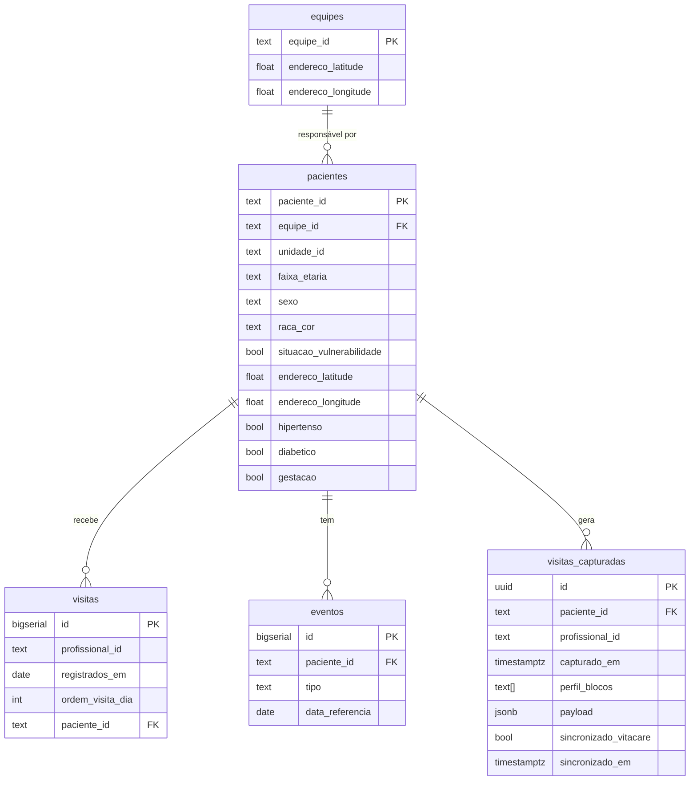

# Integração Supabase — guia do frontend

Tudo que o app ACS consome do Supabase. Quatro famílias:

1. **RPC functions** (motor PRIO-ACS, calculado server-side) — `supabase.rpc(...)`
2. **Tabelas diretas** (CRUD simples) — `supabase.from(...).select/insert`
3. **Realtime** (push via WebSocket quando dados mudam) — `supabase.channel(...)`
4. **Auth** (mock no MVP, real no piloto)

## Projeto

| Campo | Valor |
|---|---|
| URL | `https://gyutcqmrbbtftrowcyhv.supabase.co` |
| Região | South America (São Paulo) — `aws-1-sa-east-1` |
| Postgres | 17.6 |
| Project ref | `gyutcqmrbbtftrowcyhv` |
| Anon key | pega no painel **Project Settings → API → anon public** |

A anon key é pública (vai no client). `service_role` **nunca** vai no front.

---

## 1. Setup

```bash
pnpm add @supabase/supabase-js
```

```ts
// src/lib/supabase.ts
import { createClient } from '@supabase/supabase-js'
import type { Database } from './database.types'

export const supabase = createClient<Database>(
  import.meta.env.VITE_SUPABASE_URL,
  import.meta.env.VITE_SUPABASE_ANON_KEY,
)
```

```bash
# .env.local
VITE_SUPABASE_URL=https://gyutcqmrbbtftrowcyhv.supabase.co
VITE_SUPABASE_ANON_KEY=<anon public key>
```

### Gerar types TypeScript

```bash
npx supabase gen types typescript --project-id gyutcqmrbbtftrowcyhv \
  > src/lib/database.types.ts
```

(rode quando o schema mudar — precisa de `supabase login`).

---

## 2. Schema do banco



### Notas por tabela

- **`equipes`** — 49 linhas. `endereco_latitude/longitude` é a sede da unidade
  de saúde (ponto de partida do ACS).
- **`pacientes`** — 97.938 linhas. Flags clínicas + demográficas + endereço
  com ruído de até 100 m (anonimização do dataset).
- **`eventos`** — 100.503 linhas. `tipo` ∈ `{agendamento,
  urgencia-emergencia-ou-internacao}`. Datas estão *date-shifted* mas com a
  sequência preservada.
- **`visitas`** — 159.599 linhas. Histórico oficial de visitas dos ACS em
  2025 (vem do Vitacare).
- **`visitas_capturadas`** — **vazia inicialmente**. É onde o app grava
  cada visita preenchida em campo. Schema em §4.3.

Índices criados em: `pacientes(equipe_id)`, `pacientes(unidade_id)`,
`eventos(paciente_id, data_referencia DESC)`, `eventos(tipo)`,
`visitas(paciente_id, registrados_em DESC)`,
`visitas(profissional_id, registrados_em DESC)`,
`visitas_capturadas(paciente_id, capturado_em DESC)`,
`visitas_capturadas(profissional_id, capturado_em DESC)`.

---

## 3. RPC functions — motor PRIO-ACS

Todas estáveis (sem side-effects), seguras de chamar várias vezes. O score
0–100 segue a fórmula oficial do PRIO-ACS (`MASTER_CONTEXT.md` §6.4):

```
ICSAP proxy (35)  + Vulnerable life-stage (25)
+ Care gap (25)   + Social vulnerability (15)  =  score 0–100

tier:  alto (≥61, "Semanal")
       medio (31–60, "Quinzenal a mensal")
       habitual (0–30, "Mensal")
```

### 3.1 `priorizacao_pacientes(p_equipe_id, p_ref_date)`

Retorna **todos os pacientes da equipe** com score e features. Frontend
ordena/limita por necessidade da tela.

```ts
const { data, error } = await supabase
  .rpc('priorizacao_pacientes', {
    p_equipe_id: equipeId,
    p_ref_date: '2025-12-31',   // omita para usar 2025-12-31 default
  })
  .order('score', { ascending: false })
  .limit(8)
```

**Retorno (uma linha por paciente):**

| Coluna | Tipo | Descrição |
|---|---|---|
| `paciente_id` | string | hash |
| `equipe_id` | string | hash da equipe |
| `nome_display` | string | "Paciente XXXXX" (5 últimos chars do id — anonimização) |
| `faixa_etaria` | enum | `0-6` · `6-18` · `19-45` · `45-65` · `66+` |
| `sexo` | enum | `Feminino` · `Masculino` |
| `raca_cor` | string | `Branca` · `Preta` · `Parda` etc. |
| `hipertenso`, `diabetico`, `gestacao`, `situacao_vulnerabilidade` | boolean | flags |
| `endereco_latitude`, `endereco_longitude` | float | ruído ~100m (anonimização) |
| `score` | int 0–100 | total PRIO-ACS |
| `score_icsap` | int 0–35 | componente ICSAP |
| `score_life_stage` | int 0–25 | componente estágio de vida vulnerável |
| `score_care_gap` | int 0–25 | componente gap/urgência |
| `score_social` | int 0–15 | componente social |
| `tier` | enum | `alto` · `medio` · `habitual` |
| `cadencia_oficial` | string | `Semanal` · `Quinzenal a mensal` · `Mensal` |
| `linha_de_cuidado` | enum | `ficha_b_gestante` · `ficha_b_cronico` · `ficha_c_primeira_infancia` · `ficha_a_cadastro_familia` |
| `ultima_visita` | date \| null | última visita do ACS |
| `dias_gap` | int | dias desde última visita (`9999` se nunca) |
| `gap_limite` | int | dias permitidos pelo manual (30 gestante, 45 criança 0-6, 90 crônico, 180 outros) |
| `gap_vencido` | boolean | `dias_gap > gap_limite` |
| `evento_recente_60d` | boolean | evento não-eletivo (urgência) nos últimos 60d |
| `ultimo_evento_tipo`, `ultimo_evento_data` | string, date | último evento clínico registrado |
| `motivo_curto` | string | template pronto para mostrar: "Gestante diabetica, foi a urgencia ha 13 dias." |

**Latência:** ~100ms (warm). A função é `STABLE`, então o PostgREST faz cache
de result-set por request.

---

### 3.2 `dashboard_equipe(p_equipe_id, p_ref_date)`

Retorna um JSON único com indicadores agregados para a tela do gestor.

```ts
const { data } = await supabase.rpc('dashboard_equipe', {
  p_equipe_id: equipeId,
  p_ref_date: '2025-12-31',
})

// data:
// {
//   "equipe_id": "...",
//   "data": "2025-12-31",
//   "cobertura_por_linha": [
//     { "linha": "gestantes", "alvo": 28, "em_dia": 12, "atrasados": 16, "pct": 42.9 },
//     { "linha": "criancas_0_6", ... },
//     { "linha": "hipertensos", ... },
//     { "linha": "diabeticos", ... }
//   ],
//   "pacientes_nunca_visitados_pct": 23.4,
//   "alertas_criticos": [
//     { "tipo": "gestante_alto_risco_alerta", "paciente_id": "...", "dias_sem_visita": 91, "evento_recente_60d": true },
//     ...  // até 5
//   ]
// }
```

---

### 3.3 `paciente_detalhe(p_paciente_id, p_ref_date)`

Retorna o paciente com score completo + últimos 10 eventos e 10 visitas.
Use na tela de detalhe.

```ts
const { data } = await supabase.rpc('paciente_detalhe', {
  p_paciente_id: pacienteId,
  p_ref_date: '2025-12-31',
})

// data:
// {
//   "paciente": { /* mesmas colunas de priorizacao_pacientes */ },
//   "visitas_recentes": [
//     { "registrados_em": "2025-10-01", "profissional_id": "..." }, ...
//   ],
//   "eventos_recentes": [
//     { "tipo": "urgencia-emergencia-ou-internacao", "data_referencia": "2025-12-18" }, ...
//   ]
// }
```

---

## 4. Tabelas diretas

### 4.1 Listar equipes (para seleção do ACS no mock de login)

```ts
const { data: equipes } = await supabase
  .from('equipes')
  .select('equipe_id, endereco_latitude, endereco_longitude')
```

### 4.2 Listar profissionais (para "selecionar ACS" na demo)

> O dataset não tem nome de profissional. Use o id, encurte para display:
> `Profissional ${id.slice(-5)}`.

```ts
const { data } = await supabase
  .from('visitas')
  .select('profissional_id')
  .limit(1000)

// dedup no client
const acsIds = [...new Set(data?.map(v => v.profissional_id))]
```

(Se ficar lento, dá pra criar uma view `vw_profissionais_distintos` depois.)

### 4.3 Registrar visita preenchida em campo

Esta é a tabela onde o `useSync` salva os forms preenchidos:

```ts
import { supabase } from '@/lib/supabase'

await supabase.from('visitas_capturadas').insert({
  paciente_id: row.pacienteId,
  profissional_id: row.profissionalId,   // = acs_id selecionado no login
  perfil_blocos: ['hipertenso', 'pos_urgencia'],
  payload: {
    hipertenso: {
      pa_sistolica: 140,
      pa_diastolica: 90,
      adesao_medicacao: false,
      motivo_nao_adesao: 'efeito colateral'
    },
    pos_urgencia: {
      motivo_urgencia: 'crise hipertensiva',
      sintomas_atuais: ['tontura'],
      uso_de_medicacao_correto: false
    },
    observacao_livre: 'Família relatou dificuldade de acesso à medicação.'
  },
  // sincronizado_vitacare default = false (futuro: bridge com Vitacare)
})
```

**Schema da tabela:**

| Coluna | Tipo | Notas |
|---|---|---|
| `id` | `uuid` (auto) | PK |
| `paciente_id` | `text` | FK → `pacientes` |
| `profissional_id` | `text` | ACS que captou |
| `capturado_em` | `timestamptz` (auto) | `now()` |
| `perfil_blocos` | `text[]` | quais blocos do form aplicaram |
| `payload` | `jsonb` | respostas — estrutura varia por bloco |
| `sincronizado_vitacare` | `boolean` | `false` até a ponte com Vitacare ficar pronta |
| `sincronizado_em` | `timestamptz` | quando sincronizou |

**Substituindo o mock do `useSync`:** o hook atual POSTa em `/api/sync`. Em
vez disso, faz `supabase.from('visitas_capturadas').insert(registros)` —
batched é suportado, é só passar um array.

---

## 5. Realtime — motor reage à medida que dados entram

As 3 RPCs já são **real-time on read**: cada chamada recomputa o score
contra o estado atual das tabelas. Não tem JSON estático, não tem batch.

Pra o front saber **quando** rebuscar, ligamos Supabase Realtime em
`visitas_capturadas`, `eventos` e `visitas`. Assina o canal, recebe
INSERT/UPDATE/DELETE via WebSocket e refaz a chamada da lista.

```ts
import { useEffect } from 'react'

function useListaPriorizadaRealtime(equipeId: string, onChange: () => void) {
  useEffect(() => {
    const channel = supabase
      .channel(`equipe-${equipeId}`)
      // Toda visita captada em campo afeta o score (gap, ultima_visita).
      .on('postgres_changes',
        { event: 'INSERT', schema: 'public', table: 'visitas_capturadas' },
        () => onChange())
      // Futuro: quando a ponte Vitacare empurrar novos eventos/visitas.
      .on('postgres_changes',
        { event: '*', schema: 'public', table: 'eventos' },
        () => onChange())
      .on('postgres_changes',
        { event: '*', schema: 'public', table: 'visitas' },
        () => onChange())
      .subscribe()

    return () => { supabase.removeChannel(channel) }
  }, [equipeId, onChange])
}
```

**Padrão recomendado:** combine com React Query / SWR.

```ts
const { data, refetch } = useQuery({
  queryKey: ['lista', equipeId],
  queryFn: () => supabase
    .rpc('priorizacao_pacientes', { p_equipe_id: equipeId })
    .order('score', { ascending: false })
    .limit(8),
})

useListaPriorizadaRealtime(equipeId, refetch)
```

Resultado: ACS termina uma visita → grava em `visitas_capturadas` → o
backend recompute na próxima leitura → todos os clientes conectados
recebem push e refazem a lista. Ranking se reordena sozinho.

**Filtragem por equipe** (evita receber eventos de outras microáreas):

```ts
.on('postgres_changes',
  {
    event: 'INSERT',
    schema: 'public',
    table: 'visitas_capturadas',
    filter: `paciente_id=in.(${pacienteIds.join(',')})`,
  },
  () => onChange())
```

(O ideal seria filtrar por `equipe_id` direto — adicionamos uma coluna
desnormalizada em `visitas_capturadas` se virar gargalo.)


## 6. Auth e segurança — MVP

Sem RLS ligado no MVP. Anon key tem leitura/escrita total nas 5 tabelas e
permissão de `EXECUTE` nas 4 functions.

**Para a demo:**
- Tela inicial: dropdown de ACS (ver §3.2).
- Selecionado o ACS → salvar `profissional_id` no localStorage.
- Resolver a equipe num único RPC:

```ts
const { data: equipeId } = await supabase.rpc('equipe_do_profissional', {
  p_profissional_id: acsId,
})
// usa esse equipeId em priorizacao_pacientes / dashboard_equipe
```

**Segurança no MVP (defensável pro juiz):** dataset é o oficial anonimizado
da Prefeitura (k-anon ≥ 5, date-shifted, ruído geográfico 100 m). RLS está
desligado pra simplificar a demo.

**Antes de qualquer paciente real (roadmap):**
- Ligar **Row Level Security** com policies que comparam
  `auth.jwt() -> 'equipe_id'` com a coluna `equipe_id`.
- Trocar dropdown de ACS por **ConecteSUS Profissional** (OIDC).
- Audit log com `pg_audit` ou trigger em todas as leituras individuais.

---

## 7. Onde está cada função no código

| O que você vai fazer | API |
|---|---|
| Lista do dia (top N por equipe) | `rpc('priorizacao_pacientes', ...)`  +  `.order('score', desc).limit(N)` |
| Detalhe do paciente | `rpc('paciente_detalhe', ...)` |
| Dashboard do gestor | `rpc('dashboard_equipe', ...)` |
| Salvar visita preenchida | `from('visitas_capturadas').insert(...)` |
| Histórico de visitas de um paciente | já vem dentro de `paciente_detalhe`, OU `from('visitas').select(...).eq('paciente_id', ...)` |
| Eventos clínicos recentes | idem |
| Mapa: lat/lng dos pacientes priorizados | já vem em `priorizacao_pacientes` (`endereco_latitude`/`endereco_longitude`) |
| Mapa: lat/lng da unidade | `from('equipes').select('endereco_latitude, endereco_longitude').eq('equipe_id', ...)` |

---

## 8. Latências esperadas (medidas em sa-east-1)

| Call | Tempo |
|---|---|
| `priorizacao_pacientes` (1998 pacs / equipe) | ~100–500ms warm; ~2.5s cold |
| `dashboard_equipe` | ~100–200ms |
| `paciente_detalhe` | ~100–200ms |
| `insert visitas_capturadas` | ~50–100ms |

Se precisarmos derrubar mais, dá pra adicionar materialized view ou
índices específicos. Para o MVP, está bom.

---

## 9. Recarregar / resetar dados

O script de carga vive em `scripts/setup_supabase.py` (drop+recreate das 5
tabelas + reload dos 4 parquets). **Não rode em produção** — só em ambiente
de dev/demo.

```bash
pip install 'psycopg[binary]' duckdb pandas
export SUPABASE_DB_URL='postgresql://postgres.gyutcqmrbbtftrowcyhv:<senha>@aws-1-sa-east-1.pooler.supabase.com:5432/postgres'
python scripts/setup_supabase.py
```

As migrations das funções RPC e Realtime estão em `db/migrations/`:

```bash
# Aplicar tudo
psql "$SUPABASE_DB_URL" -f db/migrations/001_priorization.sql
psql "$SUPABASE_DB_URL" -f db/migrations/002_realtime.sql
```

---

## 10. O que ainda não fizemos (roadmap pós-MVP)

- RLS por `equipe_id` no JWT (substitui filtro server-side por permissão de banco)
- View `vw_profissionais_distintos` (atalho do §3.2)
- Trigger que sincroniza `visitas_capturadas` → tabela `visitas` quando
  o Vitacare aceitar o envio
- Coluna desnormalizada `equipe_id` em `visitas_capturadas` para filtrar
  Realtime por equipe diretamente (em vez de por `paciente_id IN (...)`)
- Audit log de leituras individuais de paciente
